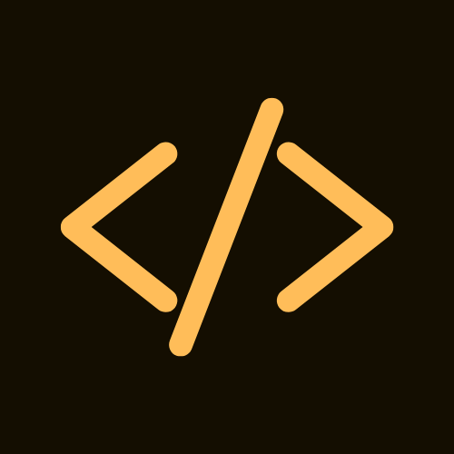

<br />
<div align="center">
      

<h3 align="center">
  <a href="https://rce70.vercel.app/">
      RCE70
  </a>
</h3>

  <p align="center">
      Remote Code Executor
   <br />
</div>

## About The Project

[![Product Name Screen Shot][product-screenshot]](https://rce70.vercel.app/)

Users can run code on the web without having to install any IDE or text editor. And it's free! There is also an interview mode, where the user can write code and give input, and the same would be shared with the interviewer. The interviewer can then run the code and see the output. The user can also download the code. The app currently supports 5 languages, C++, C, Python, Java and Javascript. The app is hosted on Vercel and Digital Ocean. The app is also containerized using Docker. The app is also serverless, and uses AWS Lamda to run the code.

## Tools Used

[![Neact][node.js]][node-url]
[![Express][express.js]][express-url]
[![React][react.js]][react-url]
[![Tailwind][tailwind]][tailwind-url]
[![Docker][docker]][docker-url]
[![AWS][aws]][aws-url]
[![Digital Ocean][digital-ocean]][digital-ocean-url]
[![Vercel][vercel]][vercel-url]
[![Vite][vite]][vite-url]
[![React Router][react-router]][react-router-url]
[![Firebase][firebase]][firebase-url]

## Packages Used

1. Axios
2. Monaco Editor
3. React Hot Toast
4. React Icons
5. React Select
6. React Spinners
7. js-file-download

## Live Demo

1. https://rce70.vercel.app : Frontend hosted on Vercel, and uses AWS Lamda serverless service

2. http://64.225.84.20/ : Kubernetes cluster hosted on Digital Ocean

## Main Features

1. Multiple language support

   ![javascript]
   ![python]
   ![c++]
   ![c]
   ![java]

2. There are three text editors, one for the code, one for the input and one for the output

3. The code can be run using the Run button or <kbd>Alt</kbd> + <kbd>Enter</kbd> key

4. The code automatically get saved in the local storage, so that the user can continue from where he left

5. The user can reset the code using the Reset button

6. The user can download the code using the Download button

7. There is an interview mode, where the user can write code and give input, and the same would be shared with the interviewer. The interviewer can then run the code and see the output.

## Thought behind the project

1. Researchers could use a Remote Code Executor app to test the security of different applications or systems, without having to run potentially dangerous code on their own machines.

2. Developers could use a Remote Code Executor app to quickly test code snippets or entire applications in a controlled environment, without having to set up a local development environment.

3. A Remote Code Executor app could be useful for teaching coding concepts and techniques, particularly for online courses or tutorials. Students could experiment with different code examples and receive immediate feedback, without having to install anything locally.

## Working

1. The user writes the code in the code editor

2. The user gives the input in the input editor

3. The user clicks on the Run button or presses <kbd>Alt</
kbd> + <kbd>Enter</kbd> key

4. The code is sent to the server.

5. The server creates a random file name and saves the code 
and input in the file with the respective extensions.

6. The server runs the code using the respective compiler or 
interpreter, with a timeout of 10 seconds.

7. The server sends the status, data and execution time to 
the client.

8. The client displays the output (or error if any) and 
execution time in the output editor.

9. To enter the interview mode, click on the _Enter interview mode_ button. The user will be given a unique link, which can be shared with the interviewer. The interviewer can then run the code and see the output.

[![Product Name Screen Shot][interviewmode-screenshot]]()

## Getting Started

### Installation through Source Code

1. Make sure that you have g++, gcc, python3, nodejs and java installed on your system. Type the following commands in your terminal to check if they are installed.

   ```sh
   g++ --version
   gcc --version
   python3 --version
   node --version
   java --version
   ```

   If required, run the following command to install the required dependencies.

   ```sh
   sudo apt install -y build-essential nodejs default-jre
   ```

2. Clone the server repo

   ```sh
   git clone https://github.com/suyashvsingh/rce70-server.git
   ```

3. Install NPM packages

   ```sh
   npm install
   ```

4. Create a `.env` file and add line `PORT=5000` to it

5. Start the application

   ```sh
   npm run dev
   ```

6. Server will run on PORT 5000

7. Clone the client repo

   ```sh
   git clone https://github.com/suyashvsingh/rce70-client.git
   ```

8. Install NPM packages

   ```sh
   npm install
   ```

9. Start the application

   ```sh
   npm run dev
   ```

10. Client will run on PORT 5173

11. Write the code, and give any input (if required)

12. Run the code using Run button or <kbd>Alt</kbd> + <kbd>Enter</kbd> key

### Installation through Docker Image

1. Make sure Docker is installed

2. Clone the compose repo

   ```sh
   git clone https://github.com/suyashvsingh/rce70-compose.git
   ```

3. Run the command

   ```sh
   docker compose up
   ```

4. Application will run on PORT 80

### Installation through Kubernetes

1. Make sure you have _Minikube_ and _kubectl_ installed

2. Clone the compose repo

   ```sh
   git clone https://github.com/suyashvsingh/rce70-k8s.git
   ```

3. Run the command

   ```sh
   kubectl apply -f .
   ```

4. Run the command

   ```sh
   minikube service rce70-client
   ```

5. Application will open in a new browser window

## Team 😃

Made with love by:

1. Sanket Diwate (2020IMT-031)
2. Ketan Prakash (2020IMT-044)
3. Aditya Pote (2020IMT-069)
4. Suyash Vikram Singh (2020IMT-104)

[product-screenshot]: public/images/HomePage.png
[interviewmode-screenshot]: public/images/InterviewMode.png
[react.js]: https://img.shields.io/badge/React-20232A?style=for-the-badge&logo=react&logoColor=61DAFB
[react-url]: https://reactjs.org/
[node.js]: https://img.shields.io/badge/Node.js-339933?style=for-the-badge&logo=nodedotjs&logoColor=white
[node-url]: https://nodejs.org/en/
[express.js]: https://img.shields.io/badge/Express.js-000000?style=for-the-badge&logo=express&logoColor=white
[express-url]: https://expressjs.com/
[tailwind]: https://img.shields.io/badge/tailwindcss-%2338B2AC.svg?style=for-the-badge&logo=tailwind-css&logoColor=white
[tailwind-url]: https://tailwindcss.com/
[docker]: https://img.shields.io/badge/docker-%230db7ed.svg?style=for-the-badge&logo=docker&logoColor=white
[docker-url]: https://www.docker.com/
[aws]: https://img.shields.io/badge/AWS-%23FF9900.svg?style=for-the-badge&logo=amazon-aws&logoColor=white
[aws-url]: https://aws.amazon.com/
[digital-ocean]: https://img.shields.io/badge/DigitalOcean-%230167ff.svg?style=for-the-badge&logo=digitalOcean&logoColor=white
[digital-ocean-url]: https://www.digitalocean.com/
[vercel]: https://img.shields.io/badge/vercel-%23000000.svg?style=for-the-badge&logo=vercel&logoColor=white
[vercel-url]: https://www.vercel.com/
[vite]: https://img.shields.io/badge/vite-%23646CFF.svg?style=for-the-badge&logo=vite&logoColor=white
[vite-url]: https://vitejs.dev/
[react-router]: https://img.shields.io/badge/React_Router-CA4245?style=for-the-badge&logo=react-router&logoColor=white
[react-router-url]: https://reactrouter.com/en/main
[firebase]: https://img.shields.io/badge/Firebase-039BE5?style=for-the-badge&logo=Firebase&logoColor=white
[firebase-url]: https://firebase.google.com/
[c++]: https://img.shields.io/badge/c++-%2300599C.svg?style=for-the-badge&logo=c%2B%2B&logoColor=white
[c]: https://img.shields.io/badge/c-%2300599C.svg?style=for-the-badge&logo=c&logoColor=white
[python]: https://img.shields.io/badge/python-3670A0?style=for-the-badge&logo=python&logoColor=ffdd54
[javascript]: https://img.shields.io/badge/javascript-%23323330.svg?style=for-the-badge&logo=javascript&logoColor=%23F7DF1E
[java]: https://img.shields.io/badge/java-%23ED8B00.svg?style=for-the-badge&logo=java&logoColor=white
